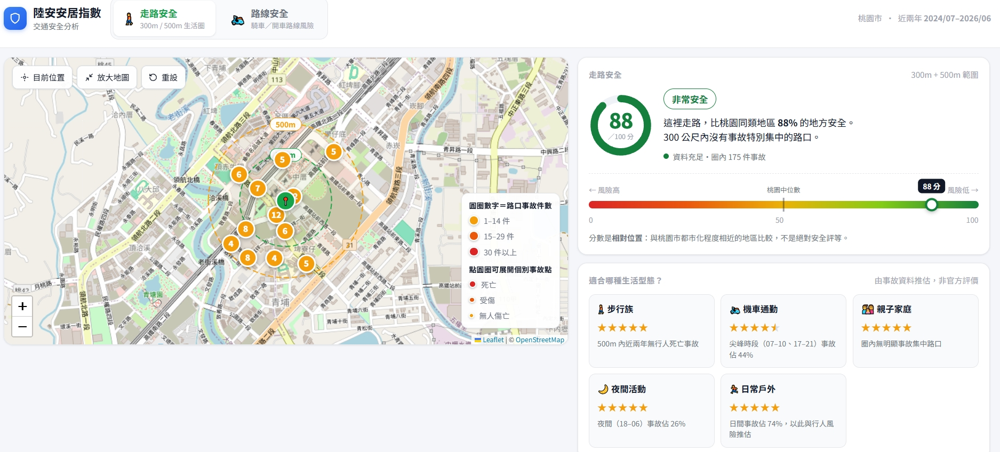
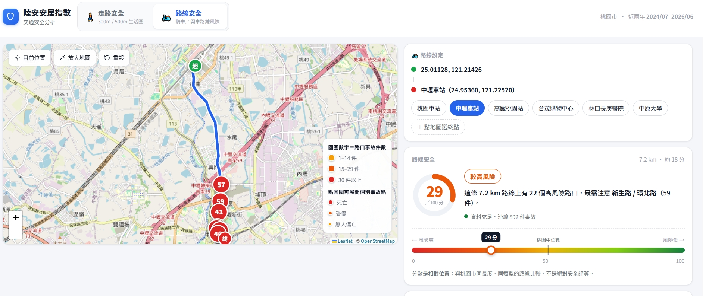

# Life House 安居指數

在桃園市地圖上選一個地點或一段路線，查看走路生活圈與騎車通勤路線的歷史交通事故風險。

> 目前資料範圍為桃園市、2024-07 至 2026-06，共 86,685 件事故。

**Demo：** 本機執行 [`make serve`](#6-快速開始) 後開啟 <http://127.0.0.1:8000>。公開雲端 Demo 尚未建立。

| 成果 | 數值／行為 |
|---|---|
| 分析範圍 | 桃園市 86,685 件歷史事故、20,269 處事故路口 |
| 生活圈 | 300／500 公尺事故熱點、相對安全百分位與情境星等 |
| 路線 | 機車最短路徑沿線的事故與高風險路口 |
| 隱私 | 個別事故座標固定偏移 ±25 公尺 |

```text
交通事故 CSV + OSM 路網
          │
          ▼
src/data（下載、驗證、篩選）
          │
          ▼
src/features（索引、路網、風險特徵）
          │
          ▼
src/serving（FastAPI） → Leaflet 前端
```

## 1. 解決甚麼問題

找房時能查到價格、格局和通勤時間，卻很難知道「孩子走去學校的路」或「每天騎車上班的路」過去是否曾是事故熱點。

原始道路交通事故資料雖然公開，卻是 51 欄、數百萬列的 CSV；每列代表一名當事人而非一件事故，且檔尾含非資料註記。一般使用者不容易從中判斷住家附近或通勤沿線的風險。

Life House 將資料轉為兩種可閱讀的分析：

- **走路生活圈**：在選定位置的 300／500 公尺範圍內，顯示事故較集中的路口、相對安全分數，以及步行、親子、夜間活動等情境的星等。
- **騎車路線**：找出起點到終點間會經過的高風險路口，協助辨識需要特別留意的路段；它不是導航服務。Render 免費版為控制記憶體，只回傳一條最短路線，且限 30 km。

分數是同類地區間的相對百分位，不是官方安全評等，也不能用來預測未來事故或作為不動產、路線選擇的專業建議。

## 2. 簡易動畫

目前先以現有操作畫面呈現互動流程；之後可替換為同一流程的 GIF（Graphics Interchange Format）或影片。



<sub>在地圖點選位置後，顯示 300m／500m 生活圈、事故集中路口與不同族群的星等。</sub>



<sub>輸入起訖點後，標示沿線事故與高風險路口；畫面範例為高鐵桃園站至中壢車站。</sub>

## 3. 用了哪些技術？為甚麼？

| 技術 | 用途與選用原因 |
|---|---|
| Python | 資料下載、清理、建索引與後端邏輯集中在同一套執行環境。 |
| FastAPI | 提供輕量的本機 API（Application Programming Interface），前端與後端同源，不需處理跨來源資源共用（CORS, Cross-Origin Resource Sharing）。 |
| Leaflet + OpenStreetMap（OSM，開放街圖） | 使用無框架前端地圖，呈現生活圈、路線與路口；OSM 提供路網與底圖。 |
| NumPy + SciPy | 以陣列運算處理事故密度、百分位與最短路徑，查詢不需重複掃描原始 CSV。 |
| SQLite FTS5（Full-Text Search 5） | 建立本機中文地名索引；`trigram` tokenizer 支援中文子字串模糊搜尋。 |
| osmium、Shapely、PyProj | 解析 OSM 路網、處理市界與地理座標，建立步行與機車分析所需的空間資料。 |

## 4. 架構

```text
政府資料開放平臺 A1 / A2 CSV + OSM 路網
                │
                ▼
下載、縣市篩選、索引與基準建置（Python）
                │
                ├── 事故索引.db      事故與路口資料
                ├── 路網.npz         步行／機車路網
                ├── 市界.npz         桃園市界
                ├── 基準.npz         同類地區的比較基準
                └── 地名.db（選配）  地址、地標與路口搜尋
                │
                ▼
FastAPI 本機服務（api.py）
                │
                ▼
Leaflet 單頁前端（index.html）
```

前端呼叫 `POST /api/v3/analyze` 進行生活圈或路線分析；`GET /api/v3/geocode` 供地址／地標搜尋；`GET /api/v3/intersection` 顯示個別事故點。後端啟動時一次載入索引與基準，後續查詢主要使用記憶體中的 NumPy 運算。

## 5. 工程亮點

- **事故資料正規化**：以「當事者順位 = 1」還原每件事故，並濾除每個 CSV 檔尾的兩行註記，避免重複計數或將註記混入資料。
- **可比較的風險分數**：以距離核加權的事故嚴重度除以同樣加權的路網長度，再與都市化程度相近的 8 個分層比較，避免山區與市區直接比較造成失真。
- **符合使用情境的路網**：排除國道與高架，並分別建立步行與機車網；路線以 Dijkstra 最短路徑演算法計算，含單行道處理與起訖點吸附上限。
- **本機中文搜尋**：地名正規化處理臺／台、全半形與中文數字等變體；FTS5 的三元字詞索引可搜尋路段、地標與路口，不必依賴外部 autocomplete 服務。
- **隱私保護**：個別事故座標使用以 MD5（Message-Digest Algorithm 5）決定的 ±25 公尺固定偏移，同一事故能穩定顯示，卻不直接公開原始座標。
- **可重建資料管線**：從下載、縣市篩選到索引、路網、基準皆提供腳本，可在資料更新後完整重建。

## 6. 快速開始

### 使用 uv（推薦）

先安裝 [uv](https://docs.astral.sh/uv/)，再執行：

```bash
make setup
make data       # 下載與篩選資料
make features   # 建立索引、路網與比較基準
make serve
```

### 使用既有建置產物

在 Windows 直接雙擊或於專案根目錄執行：

```bat
啟動.bat
```

服務就緒後會開啟 <http://127.0.0.1:8000>。

### 手動首次建置

需要 Python 3.13 以上，以及足夠的磁碟空間下載與解壓資料。先建立虛擬環境並安裝依賴：

```bash
python -m venv .venv
.venv/Scripts/python.exe -m pip install -r requirements.txt
```

再依序執行：

```bash
.venv/Scripts/python.exe 下載資料.py
.venv/Scripts/python.exe 篩選縣市.py 桃園市
.venv/Scripts/python.exe 建立索引.py
.venv/Scripts/python.exe 建立路網.py
.venv/Scripts/python.exe 建立市界.py
.venv/Scripts/python.exe 建立基準.py
.venv/Scripts/python.exe 建立地名.py  # 選配：啟用地址／地標搜尋
```

最後執行 `啟動.bat`。若不建立 `地名.db`，仍可在地圖上點選並分析，只是無法以文字搜尋地址或地標。

## 7. 深入閱讀

### 資料來源與限制

- 資料來源為 [政府資料開放平臺](https://data.gov.tw/)；提供機關為內政部警政署。A1 是死亡事故，A2 是受傷或超過 24 小時死亡的事故。
- 2026 年的資料屬當年度即時檔，可能持續補登；不可直接和完整年度比較。
- 目前只支援桃園市。市界邊緣會受界外路網影響，且機車網仍受 OSM 標註完整度限制。
- 路線功能用於辨識會經過的事故熱點，沒有轉彎限制與即時路況，不應當作導航。

### 分數計算

```text
風險 = Σ(事故嚴重度 × K(d)) ÷ Σ(路網長度 × K(d))
K(d) = 1 - (d / 500m)²
事故嚴重度 = 1 + 20 × 死亡人數
分數 = 同層中比目前位置更危險的比例
```

分子與分母使用相同的 Epanechnikov 距離核（Epanechnikov kernel），得到的是每公里有效路網的事故密度。基準只在桃園市界內取樣並依曝險分層，避免界外零事故區或山區農地將市區分數拉低。

### 專案檔案

```text
api.py             FastAPI API 與前端靜態檔服務
核心.py            空間查詢、風險計算與 Dijkstra 路徑搜尋
index.html         Leaflet 前端
建立索引.py        建立事故與路口索引
建立路網.py        建立步行／機車路網
建立市界.py        建立桃園市界資料
建立基準.py        建立相對分數的比較基準
建立地名.py        建立本機地名搜尋索引
地名正規化.py      建索引與查詢共用的地名正規化規則
```

## 8. 授權

- 交通事故資料依「政府資料開放授權條款－第 1 版」使用；資料提供機關為內政部警政署，請依該條款處理再利用與標示。
- OpenStreetMap 圖資依其 [著作權與授權條款](https://www.openstreetmap.org/copyright) 使用。
- 本儲存庫目前沒有 `LICENSE` 檔，因此程式碼尚未宣告可供第三方再利用的授權條款。
