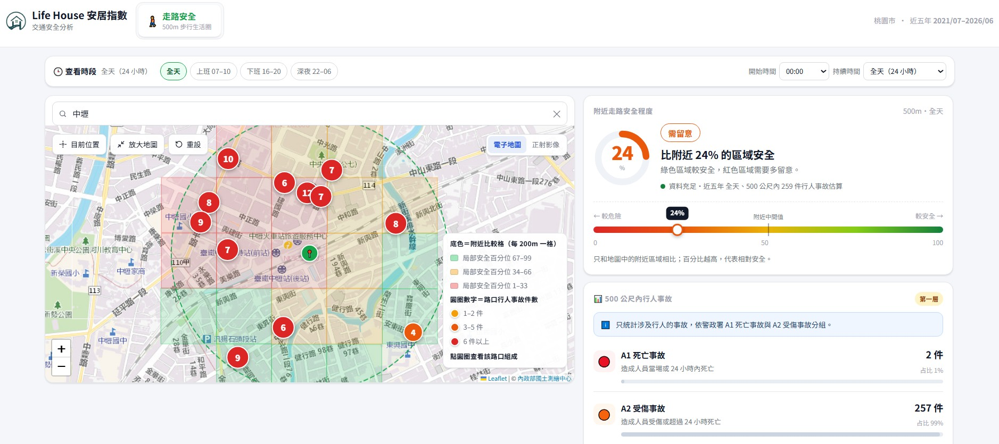

# Life House 安居指數

在桃園市地圖上選一個地點，查看周邊 500 公尺走路生活圈的歷史交通事故風險。

> 資料範圍：桃園市、2021-07-01 至 2026-06-30，共 **231,449** 件事故；
> 主要分數只使用其中 **11,726** 件涉及行人的事故。

**Demo：** 本機執行後開啟 <http://127.0.0.1:8000>（見 [6. 快速開始](#6-快速開始)）。尚未建立公開雲端 Demo。

| 項目 | 數值 |
|---|---|
| 事故資料 | 231,449 件（A1 802 / A2 230,647），死亡 828 人、受傷 302,897 人 |
| 行人事故 | 11,726 件，其中 A1 死亡事故 128 件 |
| 事故聚合位置 | 29,370 處（25m 網格 → 45m 貪婪聚合） |
| 步行路網 | 28,721 km |
| 比較基準 | 市界內 16,314 個取樣格、8 個曝險分層 |
| 地名搜尋 | 34,454 筆路段／POI／路口，另有 1,001,013 筆門牌 |
| 啟動載入 | 冷啟約 11 秒、熱啟約 4 秒（一次載入後查詢走記憶體） |

---

## 1. 解決甚麼問題

找房時查得到價格、格局和通勤時間，卻很難知道住家周邊步行範圍過去是不是事故熱點。

原始資料其實是公開的，但不好用：

- 政府資料開放平臺的 A1／A2 事故 CSV 有 51 欄、數百萬列。
- **每列代表一名當事人，不是一件事故**——直接 count 會嚴重高估。
- 每個檔案末尾夾著非資料的註記列，照讀會混進統計。
- 就算算出「附近有 N 件事故」也沒有意義：市區路多人多，事故自然多；山區農地路少，看起來永遠安全。

Life House 把這些資料轉成走路生活圈分析：在選定位置的 500 公尺範圍內，顯示事故集中路口、**經曝險校正的相對安全百分位**、風險構成與每月趨勢，並可依時段（上班、下班、深夜）篩選。

分數是桃園市同類地區之間的相對百分位，**不是官方安全評等**，不能用來預測未來事故，也不構成不動產或保險決策建議。詳見 [MODEL_CARD.md](MODEL_CARD.md)。

## 2. 簡易動畫



搜尋「中壢」後的分析結果：左側為 500 公尺生活圈，底色是每 200m 一格的局部安全百分位，
圓圈數字為該路口的行人事故件數；右側顯示相對安全分數（此處為 24%，代表比附近 24% 的區域安全）、
資料充足度說明與 A1／A2 事故組成。上方可切換全天／上班／下班／深夜時段。

**操作演示影片：** 待補（連結補上後放在此處）。

<!-- TODO: 影片上線後，把下一行取消註解並將 VIDEO_ID 換成實際影片 ID。 -->
<!-- **操作演示影片：** <https://www.youtube.com/watch?v=VIDEO_ID> -->

## 3. 用了哪些技術？為甚麼？

| 技術 | 用途 | 為甚麼選它 |
|---|---|---|
| **Python 3.13** | 資料管線與後端 | 下載、清理、建索引、查詢邏輯共用同一套環境與型別，不必跨語言搬資料。 |
| **FastAPI + Uvicorn** | 本機 API | 前端與 API 同源（`GET /` 直接回 `index.html`），完全不必處理 CORS；Pydantic 順便擋掉非法參數。 |
| **NumPy + SciPy** | 空間查詢與風險計算 | `cKDTree` 做半徑查詢、向量化算距離核與百分位。啟動時載入一次，之後查詢不再碰 CSV 或磁碟。 |
| **SQLite（內建）** | 事故索引與地名索引 | 零安裝、單檔可攜。**R-tree** 讓半徑查詢免全表掃描；**FTS5 + trigram tokenizer** 讓中文子字串搜尋可用（見 [5.6](#5-工程亮點)）。 |
| **osmium + Shapely + PyProj** | 解析 OSM、市界、投影 | osmium 是唯一能在合理記憶體內串流掃描全台 PBF 的選擇；座標一律轉 EPSG:3826（TWD97 TM2），單位公尺，距離計算不必再處理球面。 |
| **Leaflet 1.9.4** | 前端地圖 | 單一 `index.html`、**沒有 build step**、只從 CDN 載 Leaflet。改一行存檔重整就看得到。 |
| **國土測繪中心 WMTS** | 底圖 | 臺灣通用電子地圖／正射影像的臺灣門牌與巷弄細節比國際圖磚完整，且為官方公開服務。 |
| **uv + pytest + GitHub Actions** | 環境與 CI | `uv.lock` 鎖定可重現環境；CI 每次 push 跑 `uv sync` + `pytest`。 |

> OSM 只用於**路網與地名**（離線 PBF 解析），**底圖不是 OSM**，是國土測繪中心的 WMTS 服務。

## 4. 架構

```text
政府資料開放平臺 A1/A2 事故 CSV          OpenStreetMap taiwan-latest.osm.pbf
              │                                        │
              ▼                                        │
      下載資料.py（raw/ → data/）                       │
              ▼                                        │
      篩選縣市.py 桃園市（依「發生地點」開頭篩選）        │
              ▼                                        ▼
      建立索引.py                    建立路網.py ─── 建立市界.py
              │                            │              │
              ▼                            ▼              ▼
        事故索引.db  72 MB          路網.npz 23 MB   市界.npz 120 KB
        逐件事故 + R-tree           步行網（查詢用）     桃園多邊形
              │                            │              │
              └──────────────┬─────────────┴──────────────┘
                             ▼
                     建立基準.py → 基準.npz 86 KB
                     市界內取樣、8 個曝險分層的風險分布
                             │
              建立地名.py → 地名.db 52 MB（選配，文字搜尋）
                             │
                             ▼
        ┌────────────────────────────────────────────┐
        │  api.py（FastAPI）啟動時一次載入上述全部      │
        │    核心.py        空間查詢、曝險校正、風險計算 │
        │    地名查詢.py    FTS5 中文地名排序           │
        └────────────────────────────────────────────┘
                             │  同源提供
                             ▼
              index.html（Leaflet 單頁，無框架無 build）
```

### API

| 端點 | 用途 |
|---|---|
| `POST /api/v3/analyze` | 走路生活圈分析（座標 + 時段 → 分數、熱點、風險構成、趨勢） |
| `GET /api/v3/intersection` | 單一聚合位置底下的個別事故點 |
| `GET /api/v3/geocode` | 地址／地標／路口文字搜尋 |
| `GET /api/v3/meta` | 資料期間與筆數 |
| `GET /` | `index.html` |

後端啟動時把事故索引、步行路網與比較基準全部讀進記憶體，之後每次查詢都是 NumPy 陣列運算，不再讀磁碟。

## 5. 工程亮點

### 5.1 事故資料正規化：先把「當事人」還原成「事故」

原始 CSV 一列是一名當事人。`建立索引.py` 以「當事者順位 = 1」的列作為事故層級屬性來 group，並在 `篩選縣市.py` 用 `^\d{4}$` 檢查首欄以跳過檔尾註記列。少了任一步，事故件數就會被高估或混入註記。

### 5.2 分數必須經曝險校正，否則沒有鑑別力

```text
風險 = Σ(行人事故嚴重度 × 時間權重 × K(d)) ÷ Σ(步行路網長度 × K(d))

K(d) = 1 - (d / 500m)²          Epanechnikov 距離核
嚴重度 = 1 + 4 × 死亡人數        A2 = 1；A1 通常死亡 1 人 → 5
時間權重 = 1.0, 0.8, 0.6, 0.4, 0.2   依距資料截止日的年數
分數 = 同曝險層中「比此處更危險」的比例
```

分子與分母使用**同一個距離核**，得到的是「每公里有效路網的事故負擔」，而不是原始件數。再依 500m 圈內可步行路網長度切 8 個曝險分層比較，市區與山區才不會被放在同一把尺上。小樣本另有收縮先驗（`walk_shrinkage_km`），避免路網極短的格點名次亂跳。

### 5.3 用市界裁切取樣，避免製造出「假的零風險」

基準若用經緯度 bbox 矩形取樣，約有**四分之三**的點會落在新北、新竹或海上——那裡有 OSM 道路卻沒有桃園的事故資料，會被當成零事故的安全地帶，把整條分布往下拉，結果市區隨便一點都變後段班。

所以 `建立市界.py` 從 PBF 取出桃園市行政邊界（PBF 中 relation 排在 way 之後，需**分兩趟掃描**才拿得到成員座標），基準只在市界內取樣。

### 5.4 參數是量測出來的，不是猜的

從 2 年窗改成 5 年窗，是因為 2 年資料太稀疏。以 200m 網格（25,471 個有效格）實測：

| 指標 | 2 年窗 | 5 年窗 |
|---|---|---|
| 零事故格比例 | 58.9% | **46.3%** |
| ≤2 件的格比例 | 78.2% | **66.5%** |
| 中位數件數 | 0 | **1** |

近六成的格子是 0 件時，百分位排不出有意義的名次。完整結果在 [reports/五年行人事故評估.json](reports/五年行人事故評估.json)，可用 `評估五年行人事故.py` 重跑。

### 5.5 路網要符合使用情境

走路分析的曝險路網排除 `motorway`（國道）與 `trunk`（多為快速公路）——行人到不了的路，不該算進「圈內有多少路可走」，對應的事故也不該計入生活圈。

### 5.6 自建中文地理編碼，而不是接現成服務

- **為甚麼不接**：Google Places Autocomplete 的 ToS 要求結果顯示在 Google 地圖上，本專案用 Leaflet；Nominatim 公共服務的使用政策明文禁止 autocomplete 這類高頻查詢；自架 Nominatim／Photon 需要 PostGIS 或 Elasticsearch，對一個單檔 FastAPI 太重。需要的資料（PBF、事故發生地點）本來就在硬碟上。
- **索引單位選「路段」不選「門牌」**：桃園市界內光 OSM 就有 100 萬個門牌點，全丟進 FTS 會讓索引膨脹數百 MB，且搜「中山路」會被「中山路1號、3號…」淹沒。所以可搜尋的只有路段／POI／路口（34,454 筆），門牌另存在非 FTS 的 `addr` 表，用 (路段, 號) 精確查——這是真實地理編碼器的做法。
- **中文分詞**：FTS5 預設 tokenizer 不切中文，「中壢環北路」會變成單一 token 而搜不到。改用 `tokenize='trigram'`（字元三連組，等同子字串比對）即可，Python 3.13 內建的 SQLite 3.51 已含此 tokenizer，無需外掛。
- **記憶體**：掃 way 需要 `flex_mem` 載入全台節點座標（約 2 GB），門牌改成邊掃邊分批寫入暫存表，記憶體維持平坦。

### 5.7 座標誠實呈現

個別事故點直接使用政府公開、已去識別化資料中的**原始座標**，不另加隨機或固定偏移（`jitter_m = 0`）。偏移會讓使用者誤以為事故發生在別的路口。

### 5.8 可重建、可測試

從下載到基準全程腳本化，資料更新後可完整重建。10 個測試涵蓋風險基本運算、API 參數契約，以及一個**防未來資料洩漏**的時間切分測試（`tests/test_no_leakage.py`）。

```text
$ uv run pytest
10 passed
```

## 6. 快速開始

本專案的建置產物（索引、路網、基準、地名共約 150 MB）**不進版控**，改以
[GitHub Release](../../releases/latest) 附件提供。因此有兩條路：下載現成產物（數分鐘），
或從政府開放資料自行重建（約一小時）。

### 路徑 A：下載建置產物（最快）

1. 到 [Releases](../../releases/latest) 下載 `事故索引.db`、`路網.npz`、`市界.npz`、`基準.npz`，
   以及選配的 `地名.db`，全部放在專案根目錄。
2. 建立虛擬環境並安裝依賴：

   ```bash
   python -m venv .venv
   .venv/Scripts/python.exe -m pip install -r requirements.txt
   ```

3. Windows 下直接雙擊，或在專案根目錄執行：

   ```bat
   啟動.bat
   ```

腳本會檢查 `.venv` 與四個必要資料檔，服務就緒後自動開啟 <http://127.0.0.1:8000>。
其他平台可直接執行：

```bash
.venv/Scripts/python.exe -m uvicorn api:app --host 127.0.0.1 --port 8000
```

### 路徑 B：從零重建（uv，推薦）

先安裝 [uv](https://docs.astral.sh/uv/)：

```bash
make setup      # uv sync --all-groups
make data       # 下載 A1/A2 並篩出桃園市（下載＋解壓約 1.4 GB）
make features   # 建立索引、路網、市界、基準、地名
make test
make serve      # uvicorn src.serving.api:app --host 0.0.0.0 --port 8000
```

### 路徑 B 的 pip 版本

需要 Python 3.13 以上。若不使用 uv：

```bash
python -m venv .venv
.venv/Scripts/python.exe -m pip install -r requirements.txt
```

依序執行（順序不可調換，`建立路網.py` 會先下載 PBF 供後續腳本使用）：

```bash
.venv/Scripts/python.exe 下載資料.py
.venv/Scripts/python.exe 篩選縣市.py 桃園市
.venv/Scripts/python.exe 建立索引.py
.venv/Scripts/python.exe 建立路網.py
.venv/Scripts/python.exe 建立市界.py
.venv/Scripts/python.exe 建立基準.py
.venv/Scripts/python.exe 建立地名.py   # 選配，約 10 分鐘、需約 2 GB 記憶體
```

再啟動服務：

```bash
.venv/Scripts/python.exe -m uvicorn api:app --host 127.0.0.1 --port 8000
```

> 不建立 `地名.db` 仍可在地圖上點選並分析，只是無法用文字搜尋地址或地標。

### 建置產物

以下皆不進版控（見 [.gitignore](.gitignore)），由上述腳本產生或自 Release 下載：

| 檔案 | 大小 | 內容 |
|---|---|---|
| `事故索引.db` | 72 MB | 逐件事故、聚合位置、R-tree 索引、meta |
| `路網.npz` | 23 MB | 步行路網（查詢使用）＋機車路網（僅建置保留，見下） |
| `市界.npz` | 120 KB | 桃園市界多邊形 |
| `基準.npz` | 86 KB | 曝險分層的風險分布 |
| `地名.db` | 52 MB | FTS5 地名索引 + 門牌表（選配） |

## 7. 深入閱讀

### 專案文件

- [MODEL_CARD.md](MODEL_CARD.md) — 用途、輸入輸出、限制與已知偏誤、不適用情境、隱私。
- [configs/analysis.yaml](configs/analysis.yaml) — 所有可調參數（半徑、網格、嚴重度權重、時間衰減、分層數、收縮先驗）。
- [reports/五年行人事故評估.json](reports/五年行人事故評估.json) — 五年 vs 兩年窗的量化比較與樣本地點分數。

### 資料來源與限制

- 來源為 [政府資料開放平臺](https://data.gov.tw/)，提供機關內政部警政署。**A1** 為當場或 24 小時內死亡的事故；**A2** 為受傷或超過 24 小時死亡的事故。
- 2026 年屬當年度即時檔，會隨時間往後補登，**不可直接與完整年度比較**。
- 事故資料未含車流、人流與道路設計等曝險因子。密度偏低可能只反映使用量低，不等於絕對安全。
- 目前僅支援桃園市。市界邊緣仍會受界外路網與事故資料截斷影響。
- OSM 標註可能遺漏新路或步行路網資訊。

### 主要程式檔

```text
api.py             FastAPI 端點與前端靜態檔服務
核心.py            空間查詢、曝險校正、風險與百分位計算
地名查詢.py        FTS5 中文地名查詢與排序
index.html         Leaflet 單頁前端
下載資料.py        從 data.gov.tw 下載 A1／A2
篩選縣市.py        依發生地點篩出指定縣市
建立索引.py        建立事故與聚合位置索引（事故索引.db）
建立路網.py        解析 PBF 建立步行路網（路網.npz；另建機車網備用，查詢端不讀）
建立市界.py        從 PBF 取出市界多邊形（市界.npz）
建立基準.py        建立相對分數的比較基準（基準.npz）
建立地名.py        建立地名搜尋索引（地名.db）
地名正規化.py      建索引與查詢共用的正規化規則（臺／台、全半形、中文數字）
評估五年行人事故.py  產出 reports/ 的窗長比較報告
src/               可匯入的純函式與套件入口（risk / validation / serving）
tests/             pytest 測試
```

## 8. 授權

**程式碼**依 [MIT License](LICENSE) 授權。第三方資料與圖資各自沿用原授權，不因此改變：

| 對象 | 授權 | 說明 |
|---|---|---|
| 本專案原始碼 | [MIT](LICENSE) | 保留著作權聲明即可自由使用、修改與散布。 |
| 交通事故資料 A1／A2 | [政府資料開放授權條款－第 1 版](https://data.gov.tw/licenses) | 提供機關：內政部警政署。再利用請依該條款標示來源。 |
| 路網與地名（OSM） | [ODbL 1.0](https://www.openstreetmap.org/copyright) | 散布衍生資料庫須遵循相同方式分享（share-alike）義務。 |
| 地圖底圖 | [內政部國土測繪中心](https://maps.nlsc.gov.tw/) | 臺灣通用電子地圖／正射影像 WMTS，依該中心服務條款使用。 |
| Leaflet 1.9.4 | BSD 2-Clause | 前端地圖套件，自 CDN 載入。 |

各項授權的完整說明與免責聲明見 [LICENSE](LICENSE) 檔案末段。
